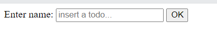
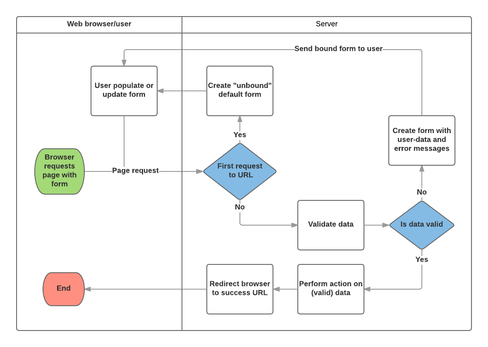

# Session 6: Forms and Validation

An [HTML Form](https://developer.mozilla.org/en-US/docs/Learn/Forms) is a group of one or more fields/widgets on a web page, which can be used to collect information from users for submission to a server. Forms are a flexible mechanism for collecting user input because there are suitable widgets for entering many different types of data, including text boxes, checkboxes, radio buttons, date pickers and so on. Forms are also a relatively secure way of sharing data with the server, as they allow us to send data in POST requests with cross-site request forgery protection.

Working with forms can be complicated! Developers need to write HTML for the form, validate and properly sanitize entered data on the server (and possibly also in the browser), repost the form with error messages to inform users of any invalid fields, handle the data when it has successfully been submitted, and finally respond to the user in some way to indicate success. Django Forms take a lot of the work out of all these steps, by providing a framework that lets you define forms and their fields programmatically, and then use these objects to both generate the form HTML code and handle much of the validation and user interaction.

## HTML Forms

First, a brief overview of HTML Forms. Consider a simple HTML form, with a single text field for entering the name of some "todo", and its associated label:

```html
<form action="/todo" method="post">
  <label for="name">Enter name: </label>
  <input id="name" type="text" name="name" placeholder="insert a todo..." />
  <input type="submit" value="OK" />
</form>
```



The role of the server is first to render the initial form state — either containing blank fields or pre-populated with initial values. After the user presses the submit button, the server will receive the form data with values from the web browser and must validate the information. If the form contains invalid data, the server should display the form again, this time with user-entered data in "valid" fields and messages to describe the problem for the invalid fields. Once the server gets a request with all valid form data, it can perform an appropriate action (such as: saving the data, returning the result of a search, uploading a file, etc.) and then notify the user.

As you can imagine, creating the HTML, validating the returned data, re-displaying the entered data with error reports if needed, and performing the desired operation on valid data can all take quite a lot of effort to "get right". Django makes this a lot easier by taking away some of the heavy lifting and repetitive code!

## Django form handling process

The view gets a request, performs any actions required including reading data from the models, then generates and returns an HTML page (from a template, into which we pass a context containing the data to be displayed). What makes things more complicated is that the server also needs to be able to process data provided by the user, and redisplay the page if there are any errors.

A process flowchart of how Django handles form requests is shown below, starting with a request for a page containing a form (shown in green).



Based on the diagram above, the main things that Django's form handling does are:

1. Display the default form the first time it is requested by the user.

- The form may contain blank fields if you're creating a new record, or it may be pre-populated with initial values (for example, if you are changing a record, or have useful default initial values).
- The form is referred to as unbound at this point, because it isn't associated with any user-entered data (though it may have initial values).

2. Receive data from a submit request and bind it to the form.

- Binding data to the form means that the user-entered data and any errors are available when we need to redisplay the form.

3. Clean and validate the data.

- Cleaning the data performs sanitization of the input fields, such as removing invalid characters that might be used to send malicious content to the server, and converts them into consistent Python types.

- Validation checks that the values are appropriate for the field (for example, that they are in the right date range, aren't too short or too long, etc.)

4. If any data is invalid, re-display the form, this time with any user populated values and error messages for the problem fields.

5. If all data is valid, perform required actions (such as save the data, send an email, return the result of a search, upload a file, and so on).

6. Once all actions are complete, redirect the user to another page.

Django provides a number of tools and approaches to help you with the tasks detailed above. The most fundamental is the Form class, which simplifies both generation of form HTML and data cleaning/validation.

## Form using a Form and function view

### Form

The Form class is the heart of Django's form handling system. It specifies the fields in the form, their layout, display widgets, labels, initial values, valid values, and (once validated) the error messages associated with invalid fields. The class also provides methods for rendering itself in templates using predefined formats (tables, lists, etc.) or for getting the value of any element (enabling fine-grained manual rendering).

### Declaring a Form

Form data is stored in an application's forms.py file, inside the application directory. Create and open the file django-project/django-app/forms.py. To create a Form, we import the forms library, derive from the Form class, and declare the form's fields

```python
from django import forms

class TodoForm(forms.Form):
    title = forms.CharField(max_length=100, help_text="Enter the todo title.")
    description = forms.CharField(widget=forms.Textarea, help_text="Enter the todo description.")
```

### Validation

Django provides numerous places where you can validate your data. The easiest way to validate a single field is to override the method clean\_<fieldname>() for the field you want to check.

```python
from django import forms
from django.core.exceptions import ValidationError
from django.utils.translation import gettext_lazy as _

class TodoForm(forms.Form):
    title = forms.CharField(max_length=100, help_text="Enter the TODO title.")
    description = forms.CharField(widget=forms.Textarea, help_text="Enter the TODO description.")

    def clean_title(self):
        data = self.cleaned_data['title']

        # Check that the title is not empty
        if not data:
            raise ValidationError(_('Invalid title - title cannot be empty'))

        # Check that the title is not too short
        if len(data) < 5:
            raise ValidationError(_('Invalid title - title too short, should be at least 5 characters'))

        # Remember to always return the cleaned data.
        return data

    def clean_description(self):
        data = self.cleaned_data['description']

        # Check that the description is not empty
        if not data:
            raise ValidationError(_('Invalid description - description cannot be empty'))

        # Check that the description is not too short
        if len(data) < 10:
            raise ValidationError(_('Invalid description - description too short, should be at least 10 characters'))

        # Remember to always return the cleaned data.
        return data

```

## URL configuration

Before we create our view, let's add a URL configuration for the renew-books page. Copy the following configuration to the bottom of django-project/app/urls.py:

```python
urlpatterns += [
    path('todo/<uuid:pk>', views.renew_book_librarian, name='create'),
]
```
